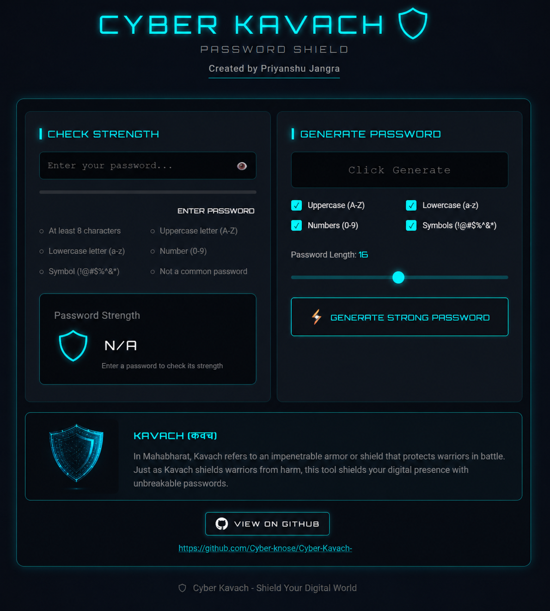

# Cyber-Kavach

  

<h1 align="center">🛡️💻 Cyber Kavach – Ultimate Digital Security App</h1>

<b>Your Digital Shield Against Cyber Threats 🛡️🔐</b>

---

Live demo:------

## 🚀 How to Use

### Step 1: Download Files Download `index.html` and `script.js`

### Step 2: Open the App - Double-click `index.html` to open in browser

### Step 3: Check Password Strength
1. Type password in the input box 
2. Watch the strength meter update
 3. Click 👁️ to show/hide password
    
 ### Step 4: Generate Password
 1. Select character types
2. Adjust password length
3. Click "Generate Strong Password"
4. Password is auto-copied!

---

## 📖 About the Project
Cyber Kavach is an innovative all-in-one application designed to empower **digital users** by combining **modern cybersecurity tools 🛡️** with **smart protection features 🔐**.  

This platform helps users stay secure online, generate strong passwords, and make smarter **digital safety decisions** in an increasingly connected world 🌐.

---

## ⚡ Features

### 🔐 Password Generator
- Generate strong & secure passwords 🛡️  
- Protect all your accounts → Maximum security 💪  

### 🔒 Security Scanner
- Scan devices for vulnerabilities 📱  
- Find & fix security gaps → Complete protection ✅  

### 🛡️ Cyber Awareness
- Learn about latest cyber threats ⚠️  
- Stay informed about frauds, phishing & scams 🚨  

### 🔍 Privacy Checker
- Check if your data has been leaked 🔎  
- Monitor email & phone for breaches 📊  

### 🌐 Safe Browsing Guide
- Best practices for secure internet usage 💻  
- Protect personal & financial data 💳  

### 📂 Data Protection Tips
- Secure your important documents 📑  
- Safe, secure & organized digital life 🔐  

---

## 🔐🌐 Cyber Awareness for Everyone

Cyber Kavach is not just a security app 🛡️ — it also focuses on making users **digitally aware and secure 🔐**.

With the increasing use of internet, everyone can become targets of **cyber frauds, phishing attacks, fake apps, and scams 🚨**.  
This app spreads awareness and guides users on how to stay safe online.

### 🧠 What This Feature Provides:
- Awareness about common cyber crimes ⚠️  
- Safe internet practices 📱  
- Protection of personal & financial data 💳  
- Easy access to trusted cyber resources 🌐  

---

## 🎯 Objective
To bridge the gap between **technology 💻** and **security 🛡️**, making users more **efficient, independent, and digitally secure**.

---

## 🛠️ Tech Stack

  
  
  
  

- 💻 Languages: HTML, CSS, JavaScript  
- ⚙️ Frameworks/Libraries: (React / Bootstrap / etc.)  
- 🗄️ Database: (Firebase / MongoDB / etc.)  
- 🌐 APIs: Security APIs, Authentication APIs  
- 🚀 Deployment: Netlify  

---

## 🚀 Future Enhancements
- 🔐 Password Manager integration  
- 📱 Mobile security app version  
- 🌐 VPN integration  
- 🤖 AI-based threat detection  
- 🔔 Real-time breach alerts  
- 📢 Latest cyber threat notifications  

---

## 👨‍💻 Author
**Priyanshu Jangra**  
💻 Cyber Security Expert | Developer  

---

## 🤝 Contribution
Contributions are welcome!  
Fork 🍴 this repo and submit a PR 🚀  

---

## ⭐ Support
If you like this project, give it a **star ⭐** and share it!

---

## 📜 License
MIT License 📄
