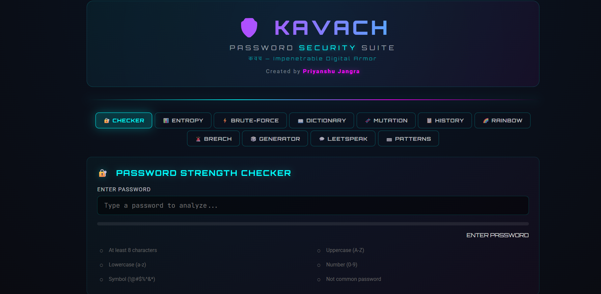

# Cyber-Kavach

  

<h1 align="center">🛡️💻 Cyber Kavach – Ultimate Digital Security App</h1>

<b>Your Digital Shield Against Cyber Threats 🛡️🔐</b>

---

## 🚀 Live Demo

**Click the button below to view the live application deployed on Netlify:**

---

## 📖 About the Project
Cyber Kavach is an innovative all-in-one application designed to empower **digital users** by combining **modern cybersecurity tools 🛡️** with **smart protection features 🔐**.  

This platform helps users stay secure online, generate strong passwords, and make smarter **digital safety decisions** in an increasingly connected world 🌐.

---

## ✨ Features

- 🔐 **Advanced Password Generator** – Generate strong, customizable, and highly secure passwords.
- 📊 **Password Entropy Analysis** – Measure password strength using entropy calculations.
- ⚡ **Brute-Force Time Estimator** – Estimate how long a password can resist cracking attacks.
- 📖 **Dictionary Attack Simulator** – Check vulnerability against common password dictionaries.
- 🌈 **Rainbow Table Demonstration** – Understand how precomputed hash attacks work.
- 🔄 **Password Mutation Analysis** – Analyze password variations and predictability.
- 🛡️ **Breach Exposure Simulation** – Simulate risks of compromised passwords.
- 🔤 **Leetspeak Detection** – Identify weak character substitutions (e.g., `P@ssw0rd`).
- ⌨️ **Keyboard Pattern Detection** – Detect predictable patterns like `qwerty` and `123456`.
- 📈 **Comprehensive Security Insights** – Receive detailed recommendations to improve password security.

## 🔐🌐 Cyber Awareness for Everyone

Cyber Kavach is not just a security app 🛡️ — it also focuses on making users **digitally aware and secure 🔐**.

With the increasing use of internet, everyone can become targets of **cyber frauds, phishing attacks, fake apps, and scams 🚨**.  
This app spreads awareness and guides users on how to stay safe online.

### 🧠 What This Feature Provides:
- Awareness about common cyber crimes ⚠️  
- Safe internet practices 📱  
- Protection of personal & financial data 💳  
- Easy access to trusted cyber resources 🌐  

---

## 🎯 Objective
To bridge the gap between **technology 💻** and **security 🛡️**, making users more **efficient, independent, and digitally secure**.

---

## 🛠️ Tech Stack

  
  
  

- 💻 Languages: HTML, CSS, JavaScript  
- ⚙️ Frameworks/Libraries: (React / Bootstrap / etc.)  
- 🗄️ Database: (Firebase / MongoDB / etc.)  

---

## 👨‍💻 Author
**Priyanshu Jangra**  
💻 Cyber Security Expert | Developer  

---

Fork 🍴 this repo  🚀  

---

## ⭐ Support
If you like this project, give it a **star ⭐** and share it!

---

## 📜 License
ALL RIGHTS ARE RESERVED
